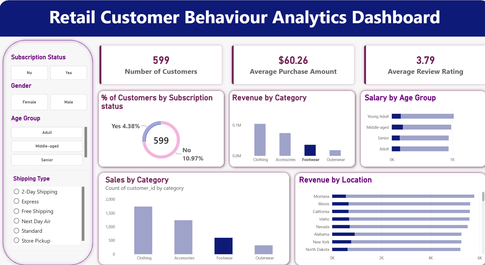

# Retail Customer Behaviour Analytics

An end-to-end analytics project that turns 3,900 raw retail transactions into a set of business-ready insights — covering data cleaning and feature engineering in Python, business-question SQL analysis in PostgreSQL, and an interactive Power BI dashboard.

## Overview

Retailers sit on transaction data but rarely turn it into decisions. This project takes a raw customer shopping dataset and works it through a full analytics pipeline — clean → model → query → visualize — to answer concrete questions about revenue drivers, discount behavior, customer loyalty, and product performance.

## Dataset

**3,900 transactions · 18 columns**, spanning three groups of fields:

| Group | Fields |
|---|---|
| Customer demographics | age, gender, location, subscription status |
| Purchase details | item purchased, category, purchase amount, season, size, color |
| Shopping behavior | discount applied, previous purchases, purchase frequency, review rating, shipping type |

## Pipeline

**1. Data cleaning & feature engineering (Python / pandas)**
- Imputed 37 missing `review_rating` values using each product category's median rather than a single global median, keeping the imputation category-aware
- Standardized all column names to `snake_case` for consistency across Python, SQL, and Power BI
- Engineered an `age_group` feature (Young Adult / Adult / Middle-aged / Senior) via quartile binning
- Converted categorical purchase frequency into a numeric `purchase_frequency_days` field
- Identified and dropped `promo_code_used` after confirming it was fully redundant with `discount_applied`

**2. Structured analysis (SQL / PostgreSQL)**
- Loaded the cleaned dataset into PostgreSQL via SQLAlchemy
- Answered 10 business questions directly in SQL — revenue by demographic, discount-dependent products, customer segmentation (New / Returning / Loyal), top products per category, and more

**3. Dashboard (Power BI)**
- Connected to PostgreSQL in Import mode
- Built an interactive dashboard with cross-filtering by subscription status, gender, age group, and shipping type

## Tech Stack

`Python` (pandas, SQLAlchemy) · `PostgreSQL` · `Power BI`

## Key Insights

- **3.9K customers** analyzed · **$59.76** average purchase amount · **3.75** average review rating
- Only **27%** of customers are active subscribers — yet subscribers and non-subscribers spend at nearly identical averages, so subscription growth wouldn't cannibalize order value
- **79%** of customers fall into the "Loyal" segment (5+ previous purchases) — the real growth lever is new customer acquisition, not retention
- **Clothing** drives the most revenue and sales volume, followed by Accessories, Footwear, and Outerwear
- Items like **Hats (50%)** and **Sneakers (49.7%)** rely on discounts for roughly half their sales, worth a margin review
- **Gloves, Sandals, and Boots** are the highest-rated products — natural candidates for featured placement

## Dashboard



## Project Structure

```
├── data/       # Raw customer shopping dataset
├── notebooks/  # Data cleaning & feature engineering (Python)
├── sql/        # Business-question SQL queries (PostgreSQL)
├── powerbi/    # Interactive dashboard (.pbix)
└── reports/    # Full write-up of methodology, findings & recommendations
```